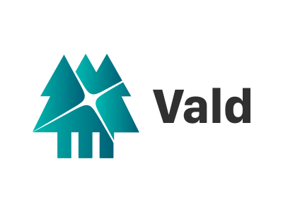
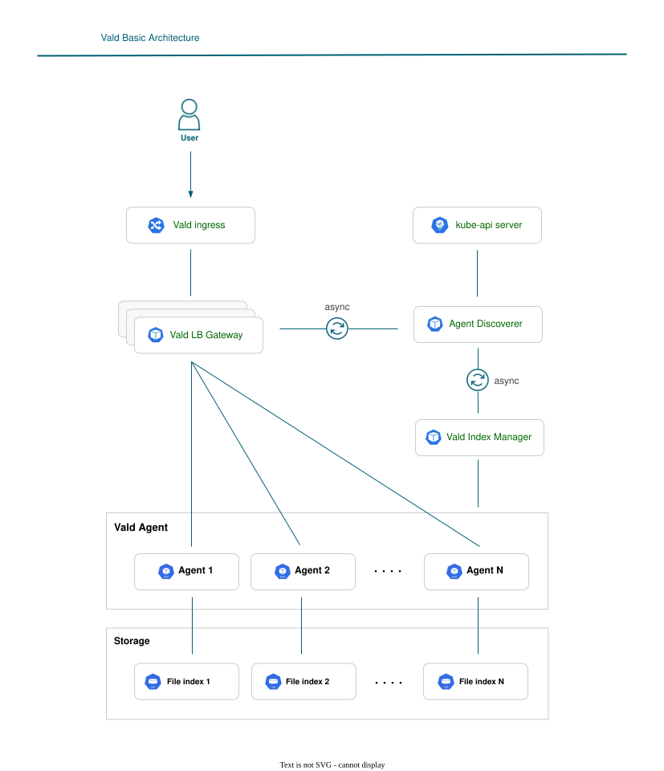

<div align="center">
<a href="https://vald.vdaas.org/">
    
</a>
</div>

[](https://opensource.org/licenses/Apache-2.0)
[](https://github.com/vdaas/vald/releases/latest)
[](https://landscape.cncf.io/?item=app-definition-and-development--database--vald)
[](https://pkg.go.dev/github.com/vdaas/vald)
[](https://www.codacy.com/app/i.can.feel.gravity/vald?utm_source=github.com&utm_medium=referral&utm_content=vdaas/vald&utm_campaign=Badge_Grade)
[](https://goreportcard.com/report/github.com/vdaas/vald)
[](https://app.fossa.com/projects/custom%2B21465%2Fvald?ref=badge_small)
[](https://deepsource.io/gh/vdaas/vald/?ref=repository-badge)
[](https://deepsource.io/gh/vdaas/vald/?ref=repository-badge)
[](https://cla-assistant.io/vdaas/vald)
[](https://artifacthub.io/packages/chart/vald/vald)
[](https://join.slack.com/t/vald-community/shared_invite/zt-db2ky9o4-R_9p2sVp8xRwztVa8gfnPA)
[](https://twitter.com/vdaas_vald)

<!--[](https://codecov.io/gh/vdaas/vald) -->


# VectorScale

### Distributed Vector Search & Indexing Engine

> **A cloud-native distributed vector search engine built in Go, designed for low-latency ANN search, horizontally scalable index serving, and fault-tolerant distributed indexing.**

[](https://go.dev/)
[](https://grpc.io/)
[](https://protobuf.dev/)
[](https://kubernetes.io/)
[](https://www.docker.com/)
[](https://opentelemetry.io/)

---

## Overview

**VectorScale** is a distributed vector search and indexing engine designed around the idea that vector similarity search should scale like a distributed systems workload rather than remain confined to a single process.

The system distributes vector indexes across multiple agents and uses **gRPC-based communication** to coordinate search operations across the cluster.

A typical query follows this path:

```text
                    ┌─────────────────────┐
                    │       Client        │
                    └──────────┬──────────┘
                               │
                               ▼
                    ┌─────────────────────┐
                    │      Gateway        │
                    │ Query Coordination  │
                    └──────────┬──────────┘
                               │
                         gRPC / Protobuf
                               │
             ┌─────────────────┼─────────────────┐
             │                 │                 │
             ▼                 ▼                 ▼
       ┌──────────┐      ┌──────────┐      ┌──────────┐
       │ Agent 01 │      │ Agent 02 │      │ Agent 03 │
       │ ANN Index│      │ ANN Index│      │ ANN Index│
       └────┬─────┘      └────┬─────┘      └────┬─────┘
            │                 │                 │
            └─────────────────┼─────────────────┘
                              ▼
                    ┌─────────────────────┐
                    │   Result Aggregator │
                    │      Top-K Merge    │
                    └──────────┬──────────┘
                               │
                               ▼
                    ┌─────────────────────┐
                    │      Response       │
                    └─────────────────────┘
```

The project focuses on the engineering challenges behind:

* Distributed ANN search
* Parallel query execution
* Vector-index partitioning
* Service-to-service communication
* Index persistence
* Replication and recovery
* Horizontal scaling
* Failure handling
* Cluster observability
* Kubernetes-based deployment

---

# Why VectorScale?

Traditional vector search can start with a single process and a single index.

That model becomes increasingly difficult when the vector corpus grows and search workloads need to scale horizontally.

VectorScale explores a distributed architecture where:

```text
                Large Vector Dataset
                         │
                         ▼
              ┌────────────────────┐
              │ Distributed Index  │
              └─────────┬──────────┘
                        │
          ┌─────────────┼─────────────┐
          ▼             ▼             ▼
       Agent 1       Agent 2       Agent 3
          │             │             │
       ANN Index      ANN Index      ANN Index
          │             │             │
          └─────────────┼─────────────┘
                        ▼
                    Top-K Merge
```

This enables the architecture to reason about **scale, latency, availability and recovery independently**.

---

# Core Architecture

## 1. Gateway

The gateway acts as the entry point for vector-search requests.

Responsibilities include:

* Accepting search requests
* Coordinating distributed queries
* Discovering available agents
* Sending requests to vector-search workers
* Collecting partial results
* Returning the aggregated Top-K response

```text
Client
  │
  ▼
Gateway
  │
  ├──────► Agent 01
  ├──────► Agent 02
  ├──────► Agent 03
  └──────► Agent N
```

---

## 2. Distributed Vector Agents

Each agent is responsible for serving a portion of the distributed vector index.

An agent can:

* Maintain a local ANN index
* Execute similarity searches
* Serve index-related requests
* Participate in distributed query execution
* Recover index state from persistent storage
* Expose operational telemetry

This allows additional agents to be introduced as cluster capacity grows.

---

## 3. ANN Search

VectorScale uses an **approximate nearest-neighbor indexing approach** to avoid exhaustive comparison against every vector.

Conceptually:

```text
Query Vector
     │
     ▼
┌───────────────┐
│ ANN Index     │
│               │
│ Candidate     │
│ Retrieval     │
└───────┬───────┘
        │
        ▼
Top Candidate Vectors
        │
        ▼
Similarity Ranking
```

The distributed layer allows multiple ANN indexes to search concurrently.

---

# Distributed Query Flow

A complete search request can be represented as:

```text
1. Client submits vector query
             │
             ▼
2. Gateway validates request
             │
             ▼
3. Gateway discovers available agents
             │
             ▼
4. Query fans out through gRPC
             │
       ┌─────┼─────┐
       ▼     ▼     ▼
      A01   A02   A03
       │     │     │
       ▼     ▼     ▼
      ANN   ANN   ANN
       │     │     │
       └─────┼─────┘
             ▼
5. Partial results returned
             │
             ▼
6. Results merged / Top-K selected
             │
             ▼
7. Response returned to client
```

The key design principle is **parallel work followed by centralized result aggregation**.

---

# Fault Tolerance & Recovery

Distributed systems must assume that individual components can fail.

VectorScale therefore treats index availability and recovery as first-class architectural concerns.

### Failure scenarios

```text
             ┌──────────┐
             │ Gateway  │
             └────┬─────┘
                  │
       ┌──────────┼──────────┐
       ▼          ▼          ▼
     Agent 1    Agent 2    Agent 3
                            ✕
                          FAILED
```

The architecture incorporates concepts such as:

* Index replication
* Persistent index backups
* Agent recovery
* Failure-aware query serving
* Index restoration
* Cluster rebalancing

The objective is to prevent the failure of one worker from becoming an implicit failure of the entire search service.

---

# Horizontal Scaling

VectorScale is designed around independently scalable search agents.

```text
                 Gateway
                    │
        ┌───────────┼───────────┐
        ▼           ▼           ▼
       A01         A02         A03

                 + A04

        ┌───────────┬───────────┬───────────┬───────────┐
        ▼           ▼           ▼           ▼
       A01         A02         A03         A04
```

Adding capacity means adding vector-search workers rather than redesigning the entire query architecture.

This makes the architecture suitable for Kubernetes-based horizontal scaling.

---

# Index Lifecycle

Vector indexes are treated as persistent system state rather than ephemeral process memory.

A simplified lifecycle:

```text
Vector Data
    │
    ▼
Index Construction
    │
    ▼
Local ANN Index
    │
    ├──────────────► Persistent Backup
    │
    ▼
Distributed Agent
    │
    ▼
Query Serving
    │
    ▼
Failure / Restart
    │
    ▼
Index Recovery
    │
    ▼
Resume Serving
```

This separates **index construction, serving and recovery** into explicit system responsibilities.

---

# Communication Layer

VectorScale uses **gRPC + Protocol Buffers** for typed communication between distributed components.

```text
Gateway
   │
   │ Protobuf Request
   ▼
gRPC
   │
   ▼
Vector Agent
   │
   │ Protobuf Response
   ▼
Gateway
```

Benefits include:

* Strongly typed service contracts
* Efficient binary serialization
* Explicit API boundaries
* Language-neutral interfaces
* Efficient service-to-service communication

---

# Observability

Distributed systems are difficult to operate without visibility into individual services.

VectorScale incorporates observability concepts around:

```text
                    VectorScale
                        │
        ┌───────────────┼───────────────┐
        ▼               ▼               ▼
     Metrics          Traces           Logs
        │               │               │
        ▼               ▼               ▼
   Prometheus      OpenTelemetry     Service Logs
        │
        ▼
     Grafana
```

The observability layer can be used to understand:

* Request latency
* Agent health
* Query fan-out
* Search execution
* Error rates
* Recovery activity
* Cluster behavior

---

# Kubernetes Deployment

VectorScale is designed for containerized deployment using Kubernetes.

A simplified deployment topology:

```text
                   Kubernetes Cluster
┌───────────────────────────────────────────────────────┐
│                                                       │
│    ┌─────────────┐                                    │
│    │   Gateway   │                                    │
│    └──────┬──────┘                                    │
│           │                                           │
│     ┌─────┼───────────────┐                           │
│     ▼     ▼               ▼                           │
│  ┌─────┐ ┌─────┐       ┌─────┐                      │
│  │ A01 │ │ A02 │  ...  │ AN  │                      │
│  └─────┘ └─────┘       └─────┘                      │
│                                                       │
│       Horizontal Scaling / Recovery                  │
│                                                       │
└───────────────────────────────────────────────────────┘
```

The deployment model supports the broader distributed-system goals of:

* Horizontal scaling
* Service isolation
* Automated scheduling
* Failure recovery
* Containerized deployment

---

# Technology Stack

| Layer                    | Technology                          |
| ------------------------ | ----------------------------------- |
| Core Engine              | **Go**                              |
| RPC                      | **gRPC**                            |
| Interface Definition     | **Protocol Buffers**                |
| Vector Search            | **NGT / ANN**                       |
| Distributed Architecture | **Gateway + Vector Agents**         |
| Containerization         | **Docker**                          |
| Orchestration            | **Kubernetes**                      |
| Cloud Deployment         | **AWS / EKS-oriented architecture** |
| Observability            | **OpenTelemetry**                   |
| Metrics                  | **Prometheus**                      |
| Dashboards               | **Grafana**                         |

---

# Engineering Focus

VectorScale is primarily a **distributed systems project**, not simply a vector database wrapper.

The major engineering areas are:

### Distributed Systems

* Query fan-out
* Distributed workers
* Replication
* Rebalancing
* Failure recovery
* Service discovery

### Backend Engineering

* Go
* gRPC
* Protocol Buffers
* Service boundaries
* Concurrent request processing

### Database / Search Systems

* ANN indexing
* Vector similarity search
* Index persistence
* Index recovery
* Top-K result aggregation

### Infrastructure

* Docker
* Kubernetes
* Horizontal scaling
* Cluster operations

### Observability

* OpenTelemetry
* Prometheus
* Grafana
* Distributed request visibility

---

# Design Principles

## Parallelize Search

Instead of forcing a single worker to search the complete corpus:

```text
Single Node

Query
 │
 ▼
████████████████████
 Entire Vector Index
```

VectorScale moves toward:

```text
Distributed

             Query
               │
       ┌───────┼───────┐
       ▼       ▼       ▼
     Index   Index   Index
       │       │       │
       └───────┼───────┘
               ▼
             Top-K
```

---

## Isolate Failure

A distributed worker should be replaceable.

```text
Healthy:

A01 ── A02 ── A03 ── A04


A03 fails:

A01 ── A02    A04
          \
           Recovery


After recovery:

A01 ── A02 ── A03 ── A04
```

---

## Make State Recoverable

Indexes should have a recovery path.

```text
                    Persistent Storage
                           │
                           ▼
                    ┌────────────┐
                    │ Index Data │
                    └─────┬──────┘
                          │
                    Restore / Load
                          │
                          ▼
                    Vector Agent
```

---

# Interactive Architecture Demo

The repository also includes a high-graphics interactive visualization of the VectorScale architecture.

The experience demonstrates:

* 3D-style distributed cluster visualization
* Animated network traffic
* Gateway-to-agent communication
* Vector search simulation
* Query fan-out
* Top-K aggregation
* Dynamic agent scaling
* Agent failure injection
* Recovery simulation
* Live telemetry visualization
* Recruiter-oriented architecture walkthrough

> **Note:** Visual telemetry in the demo is simulated for presentation purposes. Benchmark numbers should only be added when they have been measured from the actual implementation.

---

# Example Search Lifecycle

```text
                    ┌──────────────┐
                    │ Search Query │
                    └──────┬───────┘
                           │
                           ▼
                    ┌──────────────┐
                    │   Gateway    │
                    └──────┬───────┘
                           │
                 ┌─────────┼─────────┐
                 │         │         │
                 ▼         ▼         ▼
              Agent 1   Agent 2   Agent 3
                 │         │         │
                 ▼         ▼         ▼
               ANN       ANN       ANN
                 │         │         │
                 └─────────┼─────────┘
                           │
                           ▼
                    ┌──────────────┐
                    │ Top-K Merge  │
                    └──────┬───────┘
                           │
                           ▼
                    Search Response
```

---

# Getting Started

## Prerequisites

Install:

* Go 1.22+
* Docker
* Protocol Buffers compiler
* gRPC tooling
* Kubernetes / Minikube / Kind for local cluster testing

Verify Go:

```bash
go version
```

Verify Docker:

```bash
docker --version
```

Verify Kubernetes:

```bash
kubectl version --client
```

---

## Clone

```bash
git clone https://github.com/MeAkash77/VectorScale.git
cd VectorScale
```

---

## Build

```bash
go build ./...
```

---

## Test

```bash
go test ./...
```

For verbose output:

```bash
go test -v ./...
```

---

## Run Locally

```bash
go run .
```

If the repository contains separate gateway and agent services, start them according to the service-specific configuration.

---

# Containerized Deployment

Build the container:

```bash
docker build -t vectorscale:latest .
```

Run locally:

```bash
docker run --rm -p 8080:8080 vectorscale:latest
```

---

# Kubernetes

A typical deployment flow:

```bash
kubectl apply -f k8s/
```

Inspect workloads:

```bash
kubectl get pods
```

Inspect services:

```bash
kubectl get svc
```

View logs:

```bash
kubectl logs <pod-name>
```

---

# Project Structure

A recommended high-level structure:

```text
VectorScale/
│
├── cmd/
│   ├── gateway/
│   └── agent/
│
├── internal/
│   ├── gateway/
│   ├── agent/
│   ├── index/
│   ├── search/
│   ├── discovery/
│   ├── replication/
│   └── recovery/
│
├── api/
│   └── proto/
│
├── deployments/
│   ├── docker/
│   └── kubernetes/
│
├── observability/
│   ├── prometheus/
│   └── grafana/
│
├── scripts/
│
├── tests/
│
├── Dockerfile
├── go.mod
└── README.md
```

Adapt this structure to the actual repository layout rather than creating directories that do not exist.

---

# What I Learned

Building VectorScale involves several systems-level tradeoffs:

### 1. Distributed search introduces coordination cost

Parallel search can reduce the amount of work performed by each worker, but fan-out and aggregation introduce network and coordination overhead.

### 2. Index management becomes a distributed-state problem

Once indexes are distributed, lifecycle operations such as persistence, recovery and rebalancing become as important as the search algorithm itself.

### 3. Availability requires explicit failure handling

A distributed architecture only becomes resilient when node failure, state recovery and routing behavior are deliberately designed.

### 4. Observability is part of the architecture

When one request crosses multiple services, latency and failures cannot be understood from a single process log.

### 5. Scalability is more than adding machines

A scalable architecture needs clear partitioning, communication boundaries, state ownership and recovery semantics.

---

# Future Improvements

Potential extensions include:

* Dynamic shard rebalancing
* Adaptive replica placement
* Consistent-hashing based routing
* Query-result caching
* SIMD/GPU-accelerated vector search
* Multi-index search
* Streaming ingestion
* Online index updates
* Automated capacity scaling
* Advanced query scheduling
* Benchmark suite and reproducible load testing
* Chaos testing
* Cross-region replication
* SLO-driven autoscaling

---

# Performance Benchmarking

When benchmarking VectorScale, measure the complete distributed path rather than only the local ANN implementation.

Recommended metrics:

| Metric           | Description                          |
| ---------------- | ------------------------------------ |
| P50 latency      | Median search latency                |
| P95 latency      | Tail latency under normal load       |
| P99 latency      | High-percentile tail latency         |
| QPS              | Queries processed per second         |
| Recall@K         | Search quality                       |
| Fan-out latency  | Distributed query overhead           |
| Index build time | Index construction performance       |
| Recovery time    | Time to restore an unavailable agent |
| Memory usage     | Per-agent memory footprint           |
| CPU utilization  | Search workload utilization          |

Example benchmark:

```text
Load
 │
 ├── 10 concurrent clients
 ├── 100 concurrent clients
 ├── 500 concurrent clients
 └── 1000 concurrent clients
          │
          ▼
     VectorScale
          │
          ▼
 ┌──────────────────┐
 │ P50 / P95 / P99  │
 │ QPS / Recall@K   │
 │ CPU / Memory     │
 └──────────────────┘
```

> Only publish measured benchmark values from reproducible experiments.

---

# Why This Project Matters

VectorScale demonstrates engineering across multiple layers of a modern infrastructure stack:

```text
             Distributed Systems
                     │
        ┌────────────┼────────────┐
        ▼            ▼            ▼
     Backend      Databases     Infra
        │            │            │
        ▼            ▼            ▼
       Go          ANN Index   Kubernetes
        │            │            │
        └────────────┼────────────┘
                     ▼
                Observability
                     │
                     ▼
             Production Thinking
```

The central challenge is not simply:

> **"How do I search vectors?"**

It is:

> **"How do I make vector search distributed, scalable, observable and recoverable?"**

That is the engineering problem VectorScale is designed to explore.

---

# Author

**Akash Patro**

Software Engineer focused on:

* Distributed Systems
* Backend Engineering
* Databases & Storage
* Cloud Infrastructure
* High-Performance Systems
* AI/ML Infrastructure

---

## License

Add the license appropriate for the repository.

---

<p align="center">
  <strong>VectorScale</strong><br>
  Distributed Vector Search & Indexing Engine
</p>

<p align="center">
  <sub>Built to explore scalable vector search through distributed systems engineering.</sub>
</p>


## What is Vald?

Vald is a highly scalable distributed fast approximate nearest neighbor (ANN) dense vector search engine.

Vald is designed and implemented based on Cloud-Native architecture.

Vald has automatic vector indexing and index backup, and horizontal scaling which made for searching from billions of feature vector data.

Vald is easy to use, feature-rich and highly customizable as you needed.

It uses the fastest ANN Algorithm [NGT](https://github.com/NGT-labs/NGT) to search neighbors.

(If you are interested in ANN benchmarks, please refer to [ann-benchmarks.com](https://ann-benchmarks.com/).)

For more information, please refer to [Official Web Site](https://vald.vdaas.org).

<div align="center">
  
</div>

Vald can handle any object data, image, audio processing, video, text, binary, or etc., if converting to the vector, and be used for:

- Recognition
- Recommendation
- Detecting
- Grammar checker
- Real-time translator
- anything you want to do!

## Requirements

- Kubernetes 1.19~
- AVX2 instructions (required by Vald Agent NGT)

## Get Started

Go to [Get Started](https://vald.vdaas.org/docs/tutorial/get-started) page to try out Vald !

## Installation

### Using Helm

```shell
helm repo add vald https://vald.vdaas.org/charts
helm install vald-cluster vald/vald
```

If you use the default values.yaml, the `nightly` images will be installed.

### Using Helm-operator

Please refer to [vald-helm-operator](https://github.com/vdaas/vald/blob/main/charts/operator/helm).

## Components

<table>
  <tr>
    <th>Component</th>
    <th>Docker image</th>
    <th>latest image</th>
    <th>nightly image</th>
  </tr>
  <tr>
    <td>Agent NGT</td>
    <td>
      <a href="https://hub.docker.com/r/vdaas/vald-agent-ngt">
        
      </a><br/>
      <a href="https://github.com/orgs/vdaas/packages/container/package/vald/vald-agent-ngt">
        
      </a>
    </td>
    <td>
      <a href="https://hub.docker.com/r/vdaas/vald-agent-ngt/tags?page=1&name=latest">
        
      </a>
    </td>
    <td>
      <a href="https://hub.docker.com/r/vdaas/vald-agent-ngt/tags?page=1&name=nightly">
        
      </a>
    </td>
  </tr>
  <tr>
    <td>Agent Sidecar</td>
    <td>
      <a href="https://hub.docker.com/r/vdaas/vald-agent-sidecar">
        
      </a><br/>
      <a href="https://github.com/orgs/vdaas/packages/container/package/vald/vald-agent-sidecar">
        
      </a>
    </td>
    <td>
      <a href="https://hub.docker.com/r/vdaas/vald-agent-sidecar/tags?page=1&name=latest">
        
      </a>
    </td>
    <td>
      <a href="https://hub.docker.com/r/vdaas/vald-agent-sidecar/tags?page=1&name=nightly">
        
      </a>
    </td>
  </tr>
  <tr>
    <td>Discoverer</td>
    <td>
      <a href="https://hub.docker.com/r/vdaas/vald-discoverer-k8s">
        
      </a><br/>
      <a href="https://github.com/orgs/vdaas/packages/container/package/vald/vald-discoverer-k8s">
        
      </a>
    </td>
    <td>
      <a href="https://hub.docker.com/r/vdaas/vald-discoverer-k8s/tags?page=1&name=latest">
        
      </a>
    </td>
    <td>
      <a href="https://hub.docker.com/r/vdaas/vald-discoverer-k8s/tags?page=1&name=nightly">
        
      </a>
    </td>
  </tr>
  <tr>
    <td>Gateways</td>
    <td>
      <a href="https://hub.docker.com/r/vdaas/vald-lb-gateway">
        
      </a><br/>
      <a href="https://github.com/orgs/vdaas/packages/container/package/vald/vald-lb-gateway">
        
      </a><br/>
      <a href="https://hub.docker.com/r/vdaas/vald-filter-gateway">
        
      </a><br/>
      <a href="https://github.com/orgs/vdaas/packages/container/package/vald/vald-filter-gateway">
        
      </a><br/>
    </td>
    <td>
      <a href="https://hub.docker.com/r/vdaas/vald-lb-gateway/tags?page=1&name=latest">
        
      </a><br />
      <a href="https://hub.docker.com/r/vdaas/vald-filter-gateway/tags?page=1&name=latest">
        
      </a>
    </td>
    <td>
      <a href="https://hub.docker.com/r/vdaas/vald-lb-gateway/tags?page=1&name=nightly">
        
      </a><br>
      <a href="https://hub.docker.com/r/vdaas/vald-filter-gateway/tags?page=1&name=nightly">
        
      </a><br />
    </td>
  </tr>
  <tr>
    <td>Index Manager</td>
    <td>
      <a href="https://hub.docker.com/r/vdaas/vald-manager-index">
        
      </a><br/>
      <a href="https://github.com/orgs/vdaas/packages/container/package/vald/vald-manager-index">
        
      </a>
    </td>
    <td>
      <a href="https://hub.docker.com/r/vdaas/vald-manager-index/tags?page=1&name=latest">
        
      </a>
    </td>
    <td>
      <a href="https://hub.docker.com/r/vdaas/vald-manager-index/tags?page=1&name=nightly">
        
      </a>
    </td>
  </tr>
  <tr>
    <td>Helm Operator</td>
    <td>
      <a href="https://hub.docker.com/r/vdaas/vald-helm-operator">
        
      </a><br/>
      <a href="https://github.com/orgs/vdaas/packages/container/package/vald/vald-helm-operator">
        
      </a>
    </td>
    <td>
      <a href="https://hub.docker.com/r/vdaas/vald-helm-operator/tags?page=1&name=latest">
        
      </a>
    </td>
    <td>
      <a href="https://hub.docker.com/r/vdaas/vald-helm-operator/tags?page=1&name=nightly">
        
      </a>
    </td>
  </tr>
</table>

Docker images tagging policy:

- `nightly` ... latest build of main branch
- `vX.X.X` ... released versions
- `latest` ... latest build of release versions
- `stable` ... latest long-term supported version

## Tools

- [SDK](https://vald.vdaas.org/docs/user-guides/sdks/): Official client libraries
- [Demo](https://github.com/vdaas/vald-demo): Demo repository using sample data

## Vald Users

<p align="center">
  <a href="https://www.lycorp.co.jp/en/" target="_blank">
  <picture>
    <source media="(prefers-color-scheme: dark)" srcset="./assets/image/vald-users/lycorp_white.png">
    <source media="(prefers-color-scheme: light)" srcset="./assets/image/vald-users/lycorp_black.png">
    
  </picture>
  </a>
  <a href="https://jpsearch.go.jp/" target="_blank">
    
  </a>
</p>

## Contribution

Please read the [contribution guide](https://vald.vdaas.org/docs/contributing/contributing-guide).

Before your first commit to this repository, it is strongly recommended to run the commands below.

```shell
git clone https://github.com/MeAkash77/VectorScale-Distributed-Vector-Search-Indexing-Engine.git && cd vald
make init
```

## Contributors

<!-- ALL-CONTRIBUTORS-BADGE:START - Do not remove or modify this section -->

[](#contributors)

<!-- markdownlint-restore -->
<!-- prettier-ignore-end -->

<!-- ALL-CONTRIBUTORS-LIST:END -->

## LICENSE

Vald released under Apache 2.0 license, refer [LICENSE](https://github.com/MeAkash77/vald/blob/main/LICENSE) file.

[](https://app.fossa.com/projects/custom%2B21465%2Fvald?ref=badge_large)
